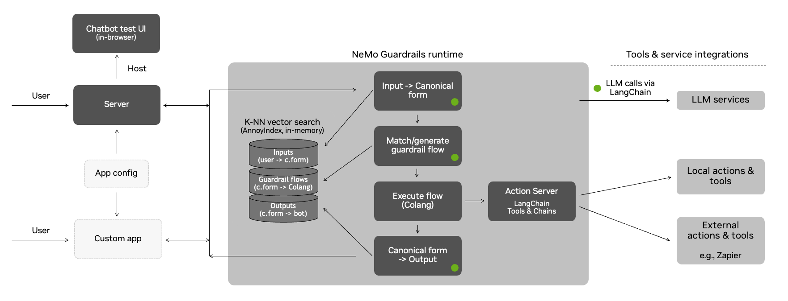
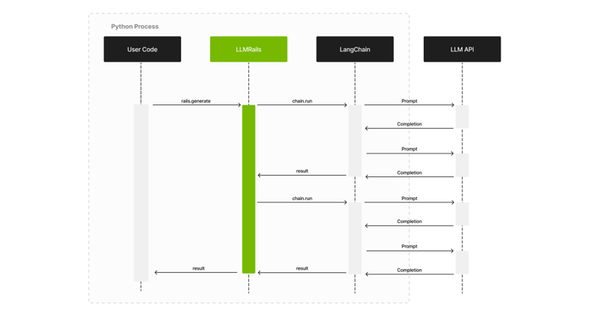
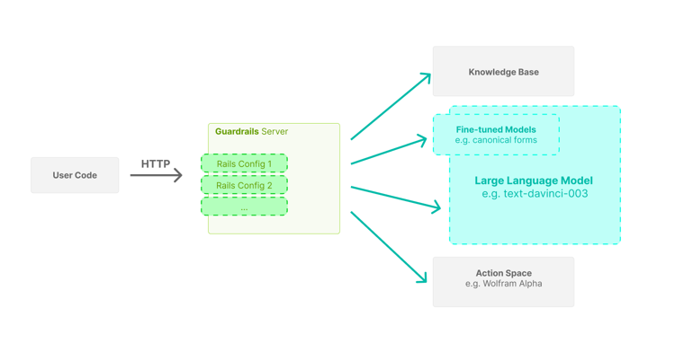

# Architecture Guide

This document provides more details on the architecture and the approach that the NeMo Guardrails toolkit takes for implementing guardrails.



## The Guardrails Process

This section explains in detail the process under the hood, from the utterance sent by the user to the bot utterance that is returned.

The guardrails runtime uses an event-driven design (i.e., an event loop that processes events and generates back other events). Whenever the user says something to the bot, a `UtteranceUserActionFinished` event is created and sent to the runtime.

The process has three main stages:

1. Generate canonical user message
2. Decide next step(s) and execute them
3. Generate bot utterance(s)

Each of the above stages can involve one or more calls to the LLM.

### Canonical User Messages

The first stage is to generate the canonical form for the user utterance. This canonical form captures the user's intent and allows the guardrails system to trigger any specific flows.

This stage is itself implemented through a colang flow:

```colang
define flow generate user intent
  """Turn the raw user utterance into a canonical form."""

  event UtteranceUserActionFinished(final_transcript="...")
  execute generate_user_intent
```

The `generate_user_intent` action will do a vector search on all the canonical form examples included in the guardrails configuration, take the top 5 and include them in a prompt, and ask the LLM to generate the canonical form for the current user utterance.

**Note**: The prompt itself contains other elements, such as the sample conversation and the current history of the conversation.

Once the canonical form is generated, a new `UserIntent` event is created.

### Decide Next Steps

Once the `UserIntent` event is created, there are two potential paths:

1. There is a pre-defined flow that can decide what should happen next; or
2. The LLM is used to decide the next step.

When the LLM is used to decide the next step, a vector search is performed for the most relevant flows from the guardrails configuration. As in the previous step, the top 5 flows are included in the prompt, and the LLM is asked to predict the next step.

This stage is implemented through a flow as well:

```colang
define flow generate next step
  """Generate the next step when there isn't any.

  We set the priority at 0.9 so it is lower than the default which is 1. So, if there
  is a flow that has a next step, it will have priority over this one.
  """
  priority 0.9

  user ...
  execute generate_next_step
```

Regardless of the path taken, there are two categories of next steps:

1. The bot should say something (`BotIntent` events)
2. The bot should execute an action (`start_action` events)

When an action needs to be executed, the runtime will invoke the action and wait for the result. When the action finishes, an `action_finished` event is created with the result of the action.

**Note**: the default implementation of the runtime is async, so the action execution is only blocking for a specific user.

When the bot should say something, the process will move to the next stage, i.e., generating the bot utterance.

After an action is executed or a bot message is generated, the runtime will try again to generate another next step (e.g., a flow might instruct the bot to execute an action, say something, then execute another action). The processing will stop when there are no more next steps.

### Generate Bot Utterances

Once the `BotIntent` event is generated, the `generate_bot_message` action is invoked.

Similar to the previous stages, the `generate_bot_message` action performs a vector search for the most relevant bot utterance examples included in the guardrails configuration. Next, they get included in the prompt, and we ask the LLM to generate the utterance for the current bot intent.

**Note**: If a knowledge base is provided in the guardrails configuration (i.e., a `kb/` folder), then a vector search is also performed for the most relevant chunks of text to include in the prompt as well (the `retrieve_relevant_chunks` action).

The flow implementing this logic is the following:

```colang
define extension flow generate bot message
  """Generate the bot utterance for a bot message.

  We always want to generate an utterance after a bot intent, hence the high priority.
  """
  priority 100

  bot ...
  execute retrieve_relevant_chunks
  execute generate_bot_message
```

Once the bot utterance is generated, a new `bot_said` event is created.

### Complete Example

An example stream of events for processing a user's request is shown below.

The conversation between the user and the bot:

```
user "how many unemployed people were there in March?"
  ask about headline numbers
bot response about headline numbers
  "According to the US Bureau of Labor Statistics, there were 8.4 million unemployed people in March 2021."
```

The stream of events processed by the guardrails runtime (a simplified view with unnecessary properties removed and values truncated for readability):

```yaml
- type: UtteranceUserActionFinished
  final_transcript: "how many unemployed people were there in March?"

# Stage 1: generate canonical form
- type: start_action
  action_name: generate_user_intent

- type: action_finished
  action_name: generate_user_intent
  status: success

- type: UserIntent
  intent: ask about headline numbers

# Stage 2: generate next step
- type: start_action
  action_name: generate_next_step

- type: action_finished
  action_name: generate_next_step
  status: success

- type: BotIntent
  intent: response about headline numbers

# Stage 3: generate bot utterance
- type: start_action
  action_name: retrieve_relevant_chunks

- type: context_update
  data:
    relevant_chunks: "The number of persons not in the labor force who ..."

- type: action_finished
  action_name: retrieve_relevant_chunks
  status: success

- type: start_action
  action_name: generate_bot_message

- type: action_finished
  action_name: generate_bot_message
  status: success

- type: bot_said
  content: "According to the US Bureau of Labor Statistics, there were 8.4 million unemployed people in March 2021."

- type: listen
```

### Extending the Default Process

As shown in the examples [here](../README.md#examples), the event-driven design allows us to hook into the process and add additional guardrails.

For example, in the [grounding rail](../../examples/grounding_rail/README.md) example, we can add an additional fact-checking guardrail (through the `check_facts` action) after a question about the report.

```colang
define flow answer report question
  user ask about report
  bot provide report answer

  $accurate = execute check_facts

  if not $accurate
    bot remove last message
    bot inform answer unknown
```

For advanced use cases, you can also override the default flows mentioned above (i.e. `generate user intent`, `generate next step`, `generate bot message`)

### Example Prompt

Below is an example of how the LLM is prompted for the canonical form generation step:

```
"""
Below is a conversation between a helpful AI assistant and a user. The bot is designed to generate human-like text based on the input that it receives. The bot is talkative and provides lots of specific details. If the bot does not know the answer to a question, it truthfully says it does not know.
"""

# This is how a conversation between a user and the bot can go:

user "Hello there!"
  express greeting
bot express greeting
  "Hello! How can I assist you today?"
user "What can you do for me?"
  ask about capabilities
bot respond about capabilities
  "I am an AI assistant which helps answer questions based on a given knowledge base. For this interaction, I can answer question based on the job report published by US Bureau of Labor Statistics"
user "Tell me a bit about the US Bureau of Labor Statistics."
  ask question about publisher
bot response for question about publisher
  "The Bureau of Labor Statistics is the principal fact-finding agency for the Federal Government in the broad field of labor economics and statistics"
user "thanks"
  express appreciation
bot express appreciation and offer additional help
  "You're welcome. If you have any more questions or if there's anything else I can help you with, please don't hesitate to ask."

# This is how the user talks:

user "What was the movement on nonfarm payroll?"
  ask about headline numbers

user "What's the number of part-time employed number?"
  ask about household survey data

user "How much did the nonfarm payroll rise by?"
  ask about headline numbers

user "What is this month's unemployment rate?"
  ask about headline numbers

user "How many long term unemployment individuals were reported?"
  ask about household survey data

# This is the current conversation between the user and the bot:

user "Hello there!"
  express greeting
bot express greeting
  "Hello! How can I assist you today?"
user "What can you do for me?"
  ask about capabilities
bot respond about capabilities
  "I am an AI assistant which helps answer questions based on a given knowledge base. For this interaction, I can answer question based on the job report published by US Bureau of Labor Statistics"
user "how many unemployed people were there in March?"
```

Notice the various sections included in the prompt: the general instruction, the sample conversation, the most relevant examples of canonical forms and the current conversation.


## Interaction with LLMs

This toolkit relies on LangChain for the interaction with LLMs. Below is a high-level sequence diagram showing the interaction between the user's code (the one using the guardrails), the `LLMRails`, LangChain and the LLM API.




## Server Architecture

This toolkit provides a guardrails server with an interface similar to publicly available LLM APIs. Using the server, integrating a guardrails configuration in your application can be as easy as replacing the initial LLM API URL with the Guardrails Server API URL.



The server is designed with high concurrency in mind, hence the async implementation using FastAPI.
