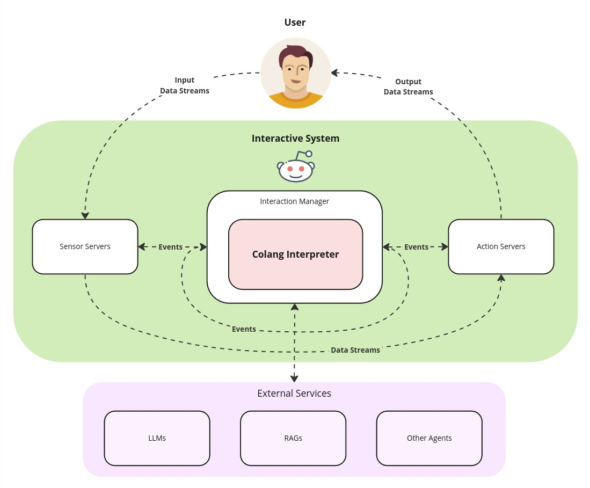

.. _reference_introduction:

========================================
Introduction
========================================

.. .. note::
..     Feedbacks & TODOs:

----------------------------------------
General Context
----------------------------------------

Colang is an event-based modeling language to enable the design of highly flexible conversational interactions between a human and a bot. Since learning a new language is not an easy task, Colang was designed as a mix of natural language and Python. If you are familiar with Python, you should feel confident using Colang after seeing a few examples, even without any explanation. Under the hood Colang scripts are interpreted by a Python runtime that is currently part of `NeMo Guardrails <https://github.com/NVIDIA/NeMo-Guardrails>`_.

To enable the control of an event-driven interactive systems, ranging from a simple text or voice-based chatbot to complex interactive avatars or robots, the Colang interpreter is usually located at the heart of the interactive system in between the system's input and output components:

  A schema of an interactive system visualizing the high-level data flow between components. The `Sensor Servers` are responsible for extracting relevant events from the user input data and forward them to the interaction manager. The `Action Servers` take care of processing events from the `Interaction Manager` to generate the output data. Note, that events generally have a smaller payload whereas the data streams can carry more data.

At the core, the Colang interpreter just processes events, detecting and generating event sequences based on the production rules defined in the Colang scripts. With the help of a large language model (LLM) and retrieval-augmented generation (RAG) services this becomes very powerful, capable of handling complex real-time interactions between a user and the system. The Unified Multimodal Interaction Management specification (:ref:`UMIM <UMIM intro>`) defines in more detail how these events can be organized in a more structured way using actions and it proposes a new standard for the event based communication between interaction managers and the components of the interactive system.

----------------------------------------
Setup & Running the Examples
----------------------------------------

In this `Language Reference` we will guide you through all the aspects of Colang with the help of different examples that you can immediately try out yourself using the provided chat command line interface (CLI) of NeMo Guardrails that is a simple example of an interactive system.

First install NeMo Guardrails:

.. code-block:: bash

    > pip install nemoguardrails

Then start a Colang example with the CLI:

.. code-block:: bash

    > nemoguardrails chat --config=<path_to_example_file_directory>

All examples can be found in the NeMo Guardrails repository under ``nemoguardrails/examples/v2_x/language_reference/``. Note, that all Colang files (``*.co``) and configuration files (``*.yaml`` or ``*.yml``) will be loaded and parsed inside the specified directory. That's why each example has its own directory.

In the following examples, input and output are distinguished by the presence or absence of prompts (``>``): to repeat the example, you must type everything after the prompt, when the prompt appears; lines that do not begin with a prompt are output from the interpreter.

----------------------------------------
`Hello World` Example
----------------------------------------

At the core, Colang defines interaction patterns as sequences of events grouped into so-called flows. Like in many programming languages the main flow (``flow main``) defines the entry point to a Colang script and will be started/activated first:

.. code-block:: colang
    :caption: introduction/hello_world/main.co

    flow main
        match InputEvent
        send HelloWorld

The event pattern defined in this first example flow waits for an event named ``InputEvent`` before generating the event named ``HelloWorld``. Running this in the chat interface, looks like this:

.. code-block:: text

    > /InputEvent
    Event: HelloWorld

Once you enter the correct event ``InputEvent`` you will see the generated event ``HelloWorld``. Any other event that you type in (using ``/`` to indicate a custom event input) will be ignored. The main flow will automatically restart once the pattern has finished.

Let's redo the previous example based on UMIM events that represent user and bot utterances:

.. code-block:: colang
    :caption: introduction/hello_world_umim/main.co

    flow main
        match UtteranceUserActionFinished()
        send StartUtteranceBotAction(script="Hello World!")

When running this example, we can trigger the bot utterance "Hello World!" in two ways, either like before by entering the raw event ``/UtteranceUserActionFinished()`` or by just typing anything without the leading ``/`` character, that will be directly interpreted as a user utterance action event ``UtteranceUserActionFinished(final_transcript="Hi")``:

.. code-block:: text

    > Hi

    Hello World!

----------------------------------------
First Interaction Pattern
----------------------------------------

Let's now build a longer interaction pattern:

.. code-block:: colang
    :caption: introduction/interaction_sequence/main.co

    flow main
        match UtteranceUserActionFinished(final_transcript="Hi")
        send StartUtteranceBotAction(script="Hi there! How are you?")
        match UtteranceUserActionFinished(final_transcript="Good and you?")
        send StartUtteranceBotAction(script="Great! Thanks")
        send StartGestureBotAction(gesture="Thumbs up")

Running this example will result in a multi-turn interaction:

.. code-block:: text

    > Hi

    Hi there! How are you?

    > Good and you?

    Great! Thanks

    Gesture: Thumbs up

Note that we can specify for every match statement not only the type of event we are expecting but also the expected parameters of that event. An event matching statement will only be considered successful and advance if the user utterance is identical to the parameter values specified.

Equipped with this basic knowledge you will now learn more about the ways of :ref:`event-generation-and-matching`.
