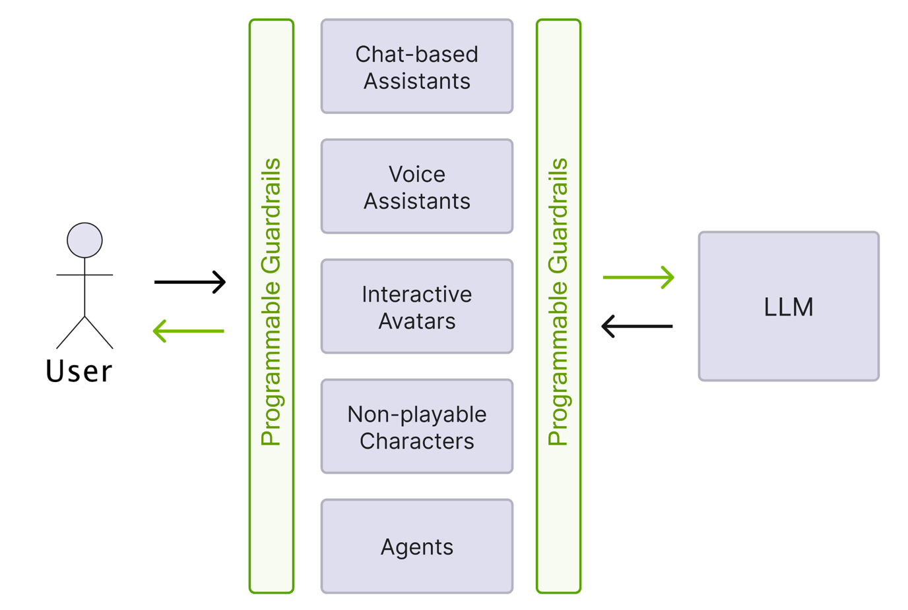
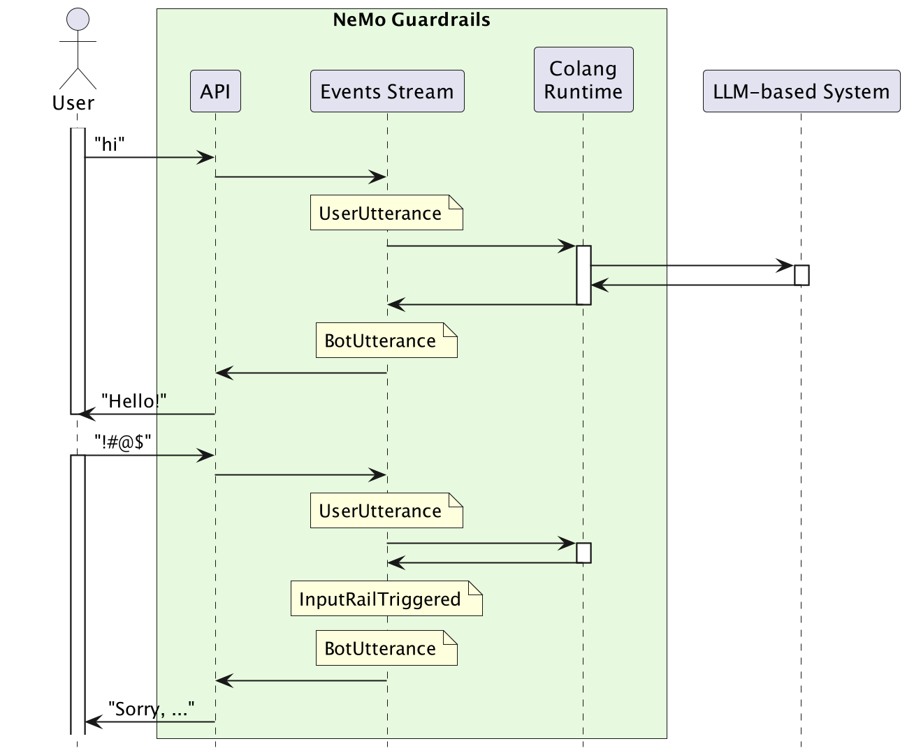

=============
Overview
=============

Colang is an *event-driven interaction modeling language* that is interpreted by a Python runtime. The initial releases of `NeMo Guardrails <https://github.com/NVIDIA/NeMo-Guardrails>`_, versions ``0.1`` through ``0.7``, uses Colang 1.0. Beginning with version ``0.8``, NeMo Guardrails introduces support for Colang 2.0, while maintaining Colang 1.0 as the default until Colang completes its beta phase.

.. list-table:: NeMo Guardrails - Colang version dependency
   :widths: 20 15
   :header-rows: 1

   * - NeMo Guardrails
     - Colang
   * - 0.1-0.7
     - 1.0
   * - 0.8
     - 2.0-alpha
   * - 0.9
     - 2.0-beta

Motivation
==========

Large Language Models (LLMs) are increasingly used in different types of conversational and interactive systems, such as chat-based assistants, voice assistants, multi-modal interactive avatars, non-playable characters in games, and fully autonomous agents. These applications use the LLMs to do more than generate text responses. They need to trigger actions and follow complex business processes.

Widely adopted approaches for achieving this include:

1. Generating code and executing it in a sand-boxed environment (e.g., generate Python code).
2. Generating the response using specific templates, which allow easier parsing of bot responses and actions that should be taken (e.g., Chain of Thought patterns).
3. Function calling and constrained output generation (e.g., JSON mode) for models that support it.

Retrieval Augmented Generation (RAG) plays a crucial role by integrating application-level and user-specific context into the generation. A comprehensive guardrails toolkit for LLMs should seamlessly accommodate all these interaction patterns.

Colang 1.0
==========

When referring to Colang, both the language and its runtime environment are implied. The initial Colang 1.0 language and runtime have several limitations.

Language limitations:

- Primarily supports text-based interactions with specialized constructs for user and bot messages.
- Limited support for natural language instructions, such as extracting user-provided values or bot message instructions.
- Lack of support for executing multiple actions or initiating multiple interaction flows concurrently.
- Does not allow the modeling of parallel interaction streams, such as simultaneous chat and avatar posture adjustments in interactive avatar systems.
- Absence of a formal language description.

Runtime limitations:

- No explicit state object to manage continuous interaction.
- Performance degrades as the number of events increases.

Colang 2.0
===========

Colang 2.0 represents a complete overhaul of both the language and runtime. Key enhancements include:

Colang 2.0-alpha
-----------------

- A more powerful flows engine supporting multiple parallel flows and advanced pattern matching over the stream of events.
- A standard library to simplify bot development.
- Smaller set of core abstractions: flows, events, and actions.
- Explicit entry point through the ``main`` flow and explicit activation of flows.
- Asynchronous actions execution.
- Adoption of terminology and syntax akin to Python to reduce the learning curve for new developers.

Colang 2.0-beta
----------------

- An import mechanism for the standard library to further streamline development.
- The new *generation operator* (``...``).
- Standalone and flow parameter expression evaluation.

Current limitations (to be fixed in NeMo Guardrails v0.10.0):

- Guardrails Library is not yet usable from within Colang 2.0.
- Generation options not supported, e.g. log activated rails, etc.

Interaction Model
=================

While there are many changes in the syntax and the underlying mechanics between Colang 1.0 and Colang 2.0, it's worth emphasizing that one core element has remained the same: *interaction model*.

In both Colang 1.0 and Colang 2.0, the interaction between the application (or user) and the LLM is an event-driven one. Examples of events include: user saying something, the LLM generating a response, triggering an action, the result of an action, the retrieval of additional info, the triggering of a guardrail, etc. In other words, the evolution of a system is modeled as a series of events, with the guardrails layer responsible for recognizing and enforcing patterns within the stream. The diagram below depicts a simplified version of the role of the events stream (the boxes with yellow background represent events).

This event-driven interaction model is part of what makes Colang a powerful modeling language, enabling the description of any type of interaction (text-based, voice-based, multi-modal, agent, multi-agent, etc.) and adding guardrails to it.

If you've used Colang 1.0 before, you should check out :ref:`What's Changed <whats-changed>` page. If not, you can get started with the :ref:`Hello World <colang_2_getting_started_hello_world>` example.
