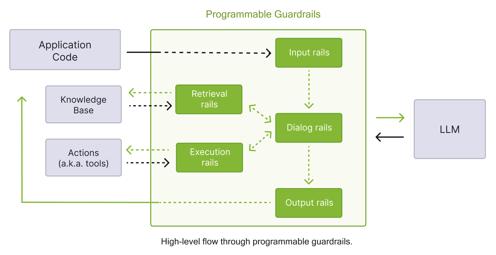

This reference documents all configuration options for `config.yml`, derived from the authoritative Pydantic schema in [`nemoguardrails/rails/llm/config.py`](https://github.com/NVIDIA-NeMo/Guardrails/blob/develop/nemoguardrails/rails/llm/config.py).

---

## Models Configuration

The `models` key defines LLM providers and models used by the NVIDIA NeMo Guardrails library.

### Model Schema

```yaml
models:
    - type: main # Required: Model type
      engine: openai # Required: LLM provider
      model: gpt-4 # Required: Model name
      mode: chat # Optional: "chat" or "text" (default: "chat")
      api_key_env_var: OPENAI_KEY # Optional: Environment variable for API key
      parameters: # Optional: Provider-specific parameters
          temperature: 0.7
          max_tokens: 1000
      cache: # Optional: Caching configuration
          enabled: false
          maxsize: 50000
```

### Model Attributes

| Attribute                | Type   | Required | Description                                                                                                                                                                                                                                                                                                                                                                                                                                                                                                                                                                                            |
| ------------------------ | ------ | -------- | ------------------------------------------------------------------------------------------------------------------------------------------------------------------------------------------------------------------------------------------------------------------------------------------------------------------------------------------------------------------------------------------------------------------------------------------------------------------------------------------------------------------------------------------------------------------------------------------------------ |
| `models.api_key_env_var` | string |          | Environment variable containing API key                                                                                                                                                                                                                                                                                                                                                                                                                                                                                                                                                                |
| `models.cache`           | object |          | Cache configuration for this model                                                                                                                                                                                                                                                                                                                                                                                                                                                                                                                                                                     |
| `models.engine`          | string | ✓        | LLM provider (see [Engines](#engines))                                                                                                                                                                                                                                                                                                                                                                                                                                                                                                                                                                 |
| `models.mode`            | string |          | Completion mode: `chat` or `text` (default: `chat`)                                                                                                                                                                                                                                                                                                                                                                                                                                                                                                                                                    |
| `models.model`           | string | ✓        | Model name (can also be in `parameters.model_name`)                                                                                                                                                                                                                                                                                                                                                                                                                                                                                                                                                    |
| `models.parameters`      | object |          | Provider-specific parameters. For engines served by the built-in client, such as any OpenAI-compatible endpoint, the runtime forwards `parameters` to the OpenAI-compatible HTTP request. Examples include `temperature`, `max_tokens`, `base_url`, `api_key`, `default_query`, and `default_headers`. `default_headers` and `default_query` configure the HTTP request rather than the request body. Refer to [Custom HTTP Headers](/configure-guardrails/yaml-schema/model-configuration#custom-http-headers) and [Model-Level Query Parameters](/configure-guardrails/yaml-schema/model-configuration#model-level-query-parameters). For engines served by LangChain, opt in with `NEMOGUARDRAILS_LLM_FRAMEWORK=langchain`; the runtime forwards `parameters` to the underlying LangChain class. For the engine-by-engine matrix, refer to [Inference Providers](/about-nemo-guardrails-library/supported-llms#inference-providers). |
| `models.type`            | string | ✓        | Model identifier (see [Model Types](#model-types))                                                                                                                                                                                                                                                                                                                                                                                                                                                                                                                                                     |

### Model Types

The `type` field is a free-form string identifier. Certain types have special handling in the runtime, while custom types can be defined and referenced in flows via `$model=<type>`.

#### Reserved Types

These types have special handling in the runtime:

| Type                  | Description                                              |
| --------------------- | -------------------------------------------------------- |
| `embeddings`          | Embedding model for knowledge base and similarity search |
| `jailbreak_detection` | Jailbreak detection model (used with NIM)                |
| `main`                | Primary application LLM for conversation                 |

#### Commonly-Used Types

The following types are commonly used with guardrails:

| Type             | Description                    | Usage Example in Flows                             |
| ---------------- | ------------------------------ | -------------------------------------------------- |
| `content_safety` | Content safety model           | `content safety check input $model=content_safety` |
| `llama_guard`    | Llama Guard content moderation | `llama guard check input $model=llama_guard`       |
| `topic_control`  | Topic control model            | `topic safety check input $model=topic_control`    |

#### Custom Types

You can define any custom type and reference it in flows. For example:

```yaml
models:
    - type: my_safety_model
      engine: self-hosted
      model: my-org/custom-safety-model

rails:
    input:
        flows:
            - content safety check input $model=my_safety_model
```

The runtime validates that any `$model=<type>` reference in flows has a matching model defined in the configuration.

### Engines

Starting with v0.22, the library serves engines through either the built-in OpenAI-compatible client or LangChain. Use the built-in client whenever the underlying wire protocol is OpenAI-compatible. Opt into LangChain only for engines whose API is not OpenAI-compatible, such as Vertex AI, Anthropic, Cohere, and the in-process Hugging Face pipeline. For the full mapping, refer to [Inference Providers](/about-nemo-guardrails-library/supported-llms#inference-providers). For migration recipes, refer to [Migrating to 0.22](/reference/0-22).

#### Built-in Engines

These engines work with `pip install nemoguardrails` and do not require extra provider packages. Pass `parameters.base_url` to point at a self-hosted or alternative endpoint.

| Engine                  | Description                                                                                                               |
| ----------------------- | ------------------------------------------------------------------------------------------------------------------------- |
| `azure`, `azure_openai` | Azure OpenAI models with key-based authentication (`azure_endpoint` or `base_url`, `azure_deployment`, and `api_version`) |
| `nim`                   | NVIDIA NIM microservices                                                                                                  |
| `nvidia_ai_endpoints`   | Alias for `nim`                                                                                                           |
| `ollama`                | Ollama OpenAI-compatible endpoint at `http://localhost:11434/v1`                                                          |
| `openai`                | OpenAI public API or any OpenAI-compatible endpoint using `parameters.base_url`                                           |

For OpenAI-compatible providers without a dedicated engine entry (vLLM, TGI, OpenRouter, Together.ai, Fireworks.ai, Groq, DeepSeek, llama.cpp server, and similar), use `engine: openai` with `parameters.base_url` and `parameters.api_key`.

#### LangChain Engines

To use one of these engines, set `NEMOGUARDRAILS_LLM_FRAMEWORK=langchain` and install the matching `langchain-*` provider package.

| Engine                 | Description                                                                                                                                                                    |
| ---------------------- | ------------------------------------------------------------------------------------------------------------------------------------------------------------------------------ |
| `anthropic`            | Anthropic Claude models                                                                                                                                                        |
| `cohere`               | Cohere models                                                                                                                                                                  |
| `google_genai`         | Google Generative AI through LangChain (requires `langchain-google-genai`)                                                                                                     |
| `huggingface_endpoint` | Hugging Face Inference Endpoints (default text-generation schema; if your endpoint exposes `/v1/chat/completions`, prefer `engine: openai` with `parameters.base_url` instead) |
| `huggingface_hub`      | Hugging Face Hub models                                                                                                                                                        |
| `huggingface_pipeline` | In-process Hugging Face pipeline                                                                                                                                               |
| `self_hosted`          | Generic self-hosted LangChain wrapper                                                                                                                                          |
| `trt_llm`              | TensorRT-LLM in-process                                                                                                                                                        |
| `vertexai`             | Google Vertex AI through LangChain (requires `langchain-google-vertexai`)                                                                                                      |
| `vllm_openai`          | Legacy LangChain wrapper for vLLM. For new configurations, prefer `engine: openai` with `parameters.base_url`                                                                  |

#### Embedding Engines

| Engine      | Description           |
| ----------- | --------------------- |
| `FastEmbed` | FastEmbed (default)   |
| `nim`       | NVIDIA NIM embeddings |
| `openai`    | OpenAI embeddings     |

### Model Cache Configuration

```yaml
models:
    - type: content_safety
      engine: nim
      model: nvidia/llama-3.1-nemotron-safety-guard-8b-v3
      cache:
          enabled: true
          maxsize: 50000
          stats:
              enabled: false
              log_interval: null
```

| Attribute                         | Type    | Default | Description                      |
| --------------------------------- | ------- | ------- | -------------------------------- |
| `models.cache.enabled`            | boolean | `false` | Enable caching for this model    |
| `models.cache.maxsize`            | integer | `50000` | Maximum cache entries            |
| `models.cache.stats.enabled`      | boolean | `false` | Enable cache statistics tracking |
| `models.cache.stats.log_interval` | float   | `null`  | Seconds between stats logging    |

---

## Rails Configuration

The `rails` key configures guardrails that control LLM behavior.

### Rails Schema

```yaml
rails:
    input:
        parallel: false
        flows:
            - self check input
            - check jailbreak

    output:
        parallel: false
        flows:
            - self check output
        streaming:
            enabled: false
            chunk_size: 200
            context_size: 50
            stream_first: true

    retrieval:
        flows:
            - check retrieval sensitive data

    dialog:
        single_call:
            enabled: false
            fallback_to_multiple_calls: true
        user_messages:
            embeddings_only: false

    actions:
        instant_actions: []

    tool_call:
        flows: []
        parallel: false

    tool_result:
        flows: []
        parallel: false

    config:
        # Rail-specific configurations
```

### Rail Types

The following table summarizes the available rail types and their trigger points.

| Rail Type           | Trigger Point                    | Purpose                                   |
| ------------------- | -------------------------------- | ----------------------------------------- |
| **Dialog rails**    | After canonical form is computed | Control conversation flow                 |
| **Execution rails** | Before/after action execution    | Control tool and action calls             |
| **Input rails**     | When user input is received      | Validate, filter, or modify user input    |
| **Output rails**    | When LLM generates output        | Validate, filter, or modify bot responses |
| **Retrieval rails** | After RAG retrieval completes    | Process retrieved chunks                  |

The following diagram shows the guardrails process described in the table above in detail.



### Input Rails

Process user messages before they reach the LLM.

```yaml
rails:
    input:
        parallel: false # Execute flows in parallel
        flows:
            - self check input
            - check jailbreak
            - mask sensitive data on input
```

| Attribute              | Type    | Default | Description                               |
| ---------------------- | ------- | ------- | ----------------------------------------- |
| `rails.input.flows`    | list    | `[]`    | Names of flows that implement input rails |
| `rails.input.parallel` | boolean | `false` | Execute input rails in parallel           |

#### Built-in Input Flows

| Flow                             | Description                       |
| -------------------------------- | --------------------------------- |
| `content safety check input`     | NVIDIA content safety model       |
| `detect sensitive data on input` | Detect and block PII              |
| `jailbreak detection heuristics` | Jailbreak detection heuristics    |
| `jailbreak detection model`      | NIM-based jailbreak detection     |
| `llama guard check input`        | LlamaGuard content moderation     |
| `mask sensitive data on input`   | Mask PII in user input            |
| `self check input`               | LLM-based policy compliance check |
| `topic safety check input`       | Topic control model               |

### Output Rails

Process LLM responses before returning to users.

```yaml
rails:
    output:
        parallel: false
        flows:
            - self check output
            - self check facts
        streaming:
            enabled: false
            chunk_size: 200
            context_size: 50
            stream_first: true
```

| Attribute                | Type    | Default | Description                                |
| ------------------------ | ------- | ------- | ------------------------------------------ |
| `rails.output.flows`     | list    | `[]`    | Names of flows that implement output rails |
| `rails.output.parallel`  | boolean | `false` | Execute output rails in parallel           |
| `rails.output.streaming` | object  |         | Streaming output configuration             |

#### Output Streaming Configuration

| Attribute                             | Type    | Default | Description                         |
| ------------------------------------- | ------- | ------- | ----------------------------------- |
| `rails.output.streaming.chunk_size`   | integer | `200`   | Tokens per processing chunk         |
| `rails.output.streaming.context_size` | integer | `50`    | Tokens carried from previous chunk  |
| `rails.output.streaming.enabled`      | boolean | `false` | Enable streaming mode               |
| `rails.output.streaming.stream_first` | boolean | `true`  | Stream before applying output rails |

#### Built-in Output Flows

| Flow                            | Description                                    |
| ------------------------------- | ---------------------------------------------- |
| `content safety check output`   | NVIDIA content safety model                    |
| `injection detection`           | Injection detection (SQL, XSS, code, template) |
| `llama guard check output`      | LlamaGuard content moderation                  |
| `mask sensitive data on output` | Mask PII in output                             |
| `self check facts`              | Fact verification                              |
| `self check hallucination`      | Hallucination detection                        |
| `self check output`             | LLM-based policy compliance check              |

### Retrieval Rails

Process chunks retrieved from knowledge base.

```yaml
rails:
    retrieval:
        flows:
            - check retrieval sensitive data
```

### Dialog Rails

Control conversation flow after user intent is determined.

```yaml
rails:
    dialog:
        single_call:
            enabled: false
            fallback_to_multiple_calls: true
        user_messages:
            embeddings_only: false
            embeddings_only_similarity_threshold: null
            embeddings_only_fallback_intent: null
```

| Attribute                                             | Type    | Default | Description                               |
| ----------------------------------------------------- | ------- | ------- | ----------------------------------------- |
| `rails.dialog.single_call.enabled`                    | boolean | `false` | Use single LLM call for intent + response |
| `rails.dialog.single_call.fallback_to_multiple_calls` | boolean | `true`  | Fall back if single call fails            |
| `rails.dialog.user_messages.embeddings_only`          | boolean | `false` | Use only embeddings for intent matching   |

### Execution Rails

Control tool and action invocations.

#### Action Rails

Control custom action and tool invocations.

```yaml
rails:
    actions:
        instant_actions:
            - action_name_1
            - action_name_2
```

#### Tool Rails

The `tool_call` rails check the tool calls a model emits, and the `tool_result` rails check the tool results returned to the model.
LLMRails runs the Colang flows configured in each section. IORails provides the following built-in structural validation flows:

```yaml
rails:
    tool_call:
        flows:
            - tool call validation
    tool_result:
        flows:
            - tool result validation
```

With IORails, each section accepts only its own built-in flow name: `tool_call` accepts `tool call validation`, and `tool_result` accepts `tool result validation`.
IORails accepts the `parallel` field for symmetry with other rails but does not honor it for tool rails.
The `tool_output` and `tool_input` fields are deprecated aliases for `tool_call` and `tool_result`, respectively.
For configuration details and behavior, see [Tool Calling](/configure-guardrails/guardrail-catalog/tool-calling).

### Rails Config Section

The `rails.config` section contains configuration for specific built-in rails.

#### Jailbreak Detection

```yaml
rails:
    config:
        jailbreak_detection:
            # Heuristics-based detection
            server_endpoint: null
            length_per_perplexity_threshold: 89.79
            prefix_suffix_perplexity_threshold: 1845.65

            # NIM-based detection
            nim_base_url: "http://localhost:8000/v1/"
            nim_server_endpoint: "classify"
            api_key_env_var: "JAILBREAK_KEY"
```

| Attribute                                                             | Type   | Default      | Description                                     |
| --------------------------------------------------------------------- | ------ | ------------ | ----------------------------------------------- |
| `rails.config.jailbreak_detection.api_key`                            | string | `null`       | API key (not recommended)                       |
| `rails.config.jailbreak_detection.api_key_env_var`                    | string | `null`       | Environment variable for API key                |
| `rails.config.jailbreak_detection.length_per_perplexity_threshold`    | float  | `89.79`      | Length/perplexity threshold                     |
| `rails.config.jailbreak_detection.nim_base_url`                       | string | `null`       | NIM base URL (e.g., `http://localhost:8000/v1`) |
| `rails.config.jailbreak_detection.nim_server_endpoint`                | string | `"classify"` | NIM endpoint path                               |
| `rails.config.jailbreak_detection.prefix_suffix_perplexity_threshold` | float  | `1845.65`    | Prefix/suffix perplexity threshold              |
| `rails.config.jailbreak_detection.server_endpoint`                    | string | `null`       | Heuristics model endpoint                       |

#### Sensitive Data Detection (Presidio)

```yaml
rails:
    config:
        sensitive_data_detection:
            recognizers: []
            input:
                entities:
                    - PERSON
                    - EMAIL_ADDRESS
                    - PHONE_NUMBER
                    - CREDIT_CARD
                mask_token: "*"
                score_threshold: 0.2
            output:
                entities:
                    - PERSON
                    - EMAIL_ADDRESS
            retrieval:
                entities: []
```

| Attribute                                                                      | Type   | Default | Description                    |
| ------------------------------------------------------------------------------ | ------ | ------- | ------------------------------ |
| `rails.config.sensitive_data_detection.input/output/retrieval.entities`        | list   | `[]`    | Entity types to detect         |
| `rails.config.sensitive_data_detection.input/output/retrieval.mask_token`      | string | `"*"`   | Token for masking              |
| `rails.config.sensitive_data_detection.input/output/retrieval.score_threshold` | float  | `0.2`   | Detection confidence threshold |
| `rails.config.sensitive_data_detection.recognizers`                            | list   | `[]`    | Custom Presidio recognizers    |

#### Injection Detection

```yaml
rails:
    config:
        injection_detection:
            injections:
                - sqli
                - template
                - code
                - xss
            action: reject # "reject" or "omit"
            yara_path: ""
            yara_rules: {}
```

| Attribute                                     | Type   | Default    | Description                                        |
| --------------------------------------------- | ------ | ---------- | -------------------------------------------------- |
| `rails.config.injection_detection.action`     | string | `"reject"` | Action: `reject` or `omit`                         |
| `rails.config.injection_detection.injections` | list   | `[]`       | Injection types: `sqli`, `template`, `code`, `xss` |
| `rails.config.injection_detection.yara_path`  | string | `""`       | Custom YARA rules path                             |
| `rails.config.injection_detection.yara_rules` | object | `{}`       | Inline YARA rules                                  |

#### Fact Checking

```yaml
rails:
    config:
        fact_checking:
            parameters:
                endpoint: "http://localhost:5000"
            fallback_to_self_check: false
```

#### Content Safety

```yaml
rails:
    config:
        content_safety:
            multilingual:
                enabled: false
                refusal_messages:
                    en: "Sorry, I cannot help with that."
                    es: "Lo siento, no puedo ayudar con eso."
```

The multilingual feature supports the following languages:

| Language | Code |
| -------- | ---- |
| Arabic   | `ar` |
| Chinese  | `zh` |
| English  | `en` |
| French   | `fr` |
| German   | `de` |
| Hindi    | `hi` |
| Japanese | `ja` |
| Spanish  | `es` |
| Thai     | `th` |

If the detected language is not in this list, English is used as the fallback. For more information, refer to [Multilingual Content Safety](/configure-guardrails/guardrail-catalog/content-safety#multilingual-refusal-messages).

#### Third-Party Integrations

##### AutoAlign

```yaml
rails:
    config:
        autoalign:
            parameters: {}
            input:
                guardrails_config: {}
            output:
                guardrails_config: {}
```

For more information, refer to [AutoAlign Integration](/configure-guardrails/guardrail-catalog/third-party/auto-align).

##### Patronus

```yaml
rails:
    config:
        patronus:
            input:
                evaluate_config:
                    success_strategy: all_pass # or any_pass
                    params: {}
            output:
                evaluate_config:
                    success_strategy: all_pass
                    params: {}
```

For more information, refer to [Patronus Evaluate API Integration](/configure-guardrails/guardrail-catalog/third-party/patronus-evaluate-api).

##### Clavata

```yaml
rails:
    config:
        clavata:
            server_endpoint: "https://gateway.app.clavata.ai:8443"
            policies: {}
            label_match_logic: ANY # or ALL
            input:
                policy: "policy_alias"
                labels: []
            output:
                policy: "policy_alias"
                labels: []
```

For more information, refer to [Clavata Integration](/configure-guardrails/guardrail-catalog/third-party/clavata).

##### Pangea AI Guard

```yaml
rails:
    config:
        pangea:
            input:
                recipe: "recipe_key"
            output:
                recipe: "recipe_key"
```

For more information, refer to [Pangea AI Guard Integration](/configure-guardrails/guardrail-catalog/third-party/pangea).

##### Trend Micro

```yaml
rails:
    config:
        trend_micro:
            v1_url: "https://api.xdr.trendmicro.com/beta/aiSecurity/guard"
            api_key_env_var: "TREND_MICRO_API_KEY"
```

For more information, refer to [Trend Micro Integration](/configure-guardrails/guardrail-catalog/third-party/trend-micro).

##### Cisco AI Defense

```yaml
rails:
    config:
        ai_defense:
            timeout: 30.0
            fail_open: false
```

For more information, refer to [Cisco AI Defense Integration](/configure-guardrails/guardrail-catalog/third-party/ai-defense).

##### Private AI

```yaml
rails:
    config:
        private_ai_detection:
            server_endpoint: "http://localhost:8080/process/text"
            input:
                entities: []
            output:
                entities: []
            retrieval:
                entities: []
```

For more information, refer to [Private AI Integration](/configure-guardrails/guardrail-catalog/third-party/privateai).

##### Fiddler Guardrails

```yaml
rails:
    config:
        fiddler:
            fiddler_endpoint: "http://localhost:8080/process/text"
            safety_threshold: 0.1
            faithfulness_threshold: 0.05
```

For more information, refer to [Fiddler Guardrails Integration](/configure-guardrails/guardrail-catalog/third-party/fiddler).

##### Guardrails AI

```yaml
rails:
    config:
        guardrails_ai:
            input:
                validators:
                    - name: toxic_language
                      parameters:
                          threshold: 0.5
                      metadata: {}
            output:
                validators:
                    - name: pii
                      parameters: {}
```

For more information, refer to [Guardrails AI Integration](/configure-guardrails/guardrail-catalog/third-party/guardrails-ai).

---

## Prompts Configuration

Define prompts for LLM tasks.

```yaml
prompts:
    - task: self_check_input
      content: |
          Your task is to check if the user input is safe.
          User input: {{ user_input }}
          Answer [Yes/No]:
      output_parser: null
      max_length: 16000
      max_tokens: null
      mode: standard
      stop: null
      models: null # Restrict to specific engines/models
```

| Attribute               | Type    | Default      | Description                                                      |
| ----------------------- | ------- | ------------ | ---------------------------------------------------------------- |
| `prompts.content`       | string  |              | Prompt template (mutually exclusive with `messages`)             |
| `prompts.max_length`    | integer | `16000`      | Maximum prompt length (characters)                               |
| `prompts.max_tokens`    | integer | `null`       | Maximum response tokens                                          |
| `prompts.messages`      | list    |              | Chat messages (mutually exclusive with `content`)                |
| `prompts.mode`          | string  | `"standard"` | Prompting mode                                                   |
| `prompts.models`        | list    | `null`       | Restrict to engines/models (e.g., `["openai", "nim/llama-3.1"]`) |
| `prompts.output_parser` | string  | `null`       | Output parser name                                               |
| `prompts.stop`          | list    | `null`       | Stop tokens                                                      |
| `prompts.task`          | string  | ✓            | Task identifier                                                  |

### Available Tasks

The following table lists all available tasks you can specify to `prompts.task`.

| Task                       | Description                                   |
| -------------------------- | --------------------------------------------- |
| `general`                  | General response generation (no dialog rails) |
| `generate_bot_message`     | Generate bot response                         |
| `generate_next_steps`      | Determine next conversation step              |
| `generate_user_intent`     | Generate canonical user intent                |
| `self_check_facts`         | Verify factual accuracy of responses          |
| `self_check_hallucination` | Detect hallucinations in responses            |
| `self_check_input`         | Check if user input complies with policy      |
| `self_check_output`        | Check if bot output complies with policy      |

### Available Prompt Message Types

The following table lists all available message types you can specify to `prompts.messages.type`.

| Type        | Description                   |
| ----------- | ----------------------------- |
| `assistant` | Assistant/bot message content |
| `bot`       | Alias for `assistant`         |
| `system`    | System-level instructions     |
| `user`      | User message content          |

---

## Other Configuration Options

### Instructions

```yaml
instructions:
    - type: general
      content: |
          You are a helpful assistant.
```

### Sample Conversation

```yaml
sample_conversation: |
    user "Hello there!"
      express greeting
    bot express greeting
      "Hello! How can I assist you today?"
    user "What can you do for me?"
      ask about capabilities
    bot respond about capabilities
      "As an AI assistant, I can help you with a wide range of tasks."
```

### Knowledge Base

```yaml
knowledge_base:
    folder: kb
    embedding_search_provider:
        name: default
        parameters: {}
        cache:
            enabled: false
```

### Core Settings

```yaml
core:
    embedding_search_provider:
        name: default
        parameters: {}
```

### Tracing

```yaml
tracing:
    enabled: false
    adapters:
        - name: FileSystem
    span_format: opentelemetry
    enable_content_capture: false
```

### Streaming

```{deprecated} v0.20.0
The top-level `streaming` field is a boolean that is no longer required. Use the `stream_async()` method directly instead. For output rail streaming configuration, see [Output Streaming Configuration](#output-streaming-configuration).
```

```yaml
streaming: false
```

### Import Paths

```yaml
import_paths:
    - path/to/shared/config
```

---

## Complete Example

The following YAML example demonstrates a complete `config.yml` file that wires together a main language model, a dedicated content safety model, and an embeddings model. It configures rails for input and output content safety checks, points to a local NIM service for jailbreak detection, defines a content safety prompt, provides general instructions for the assistant, and enables response streaming from both the main and content safety models.

```yaml
models:
    # Main application LLM
    - type: main
      engine: nim
      model: meta/llama-3.1-70b-instruct
      parameters:
          temperature: 0.7

    # Content safety model
    - type: content_safety
      engine: nim
      parameters:
          base_url: "http://localhost:8000/v1"
          model_name: "nvidia/llama-3.1-nemotron-safety-guard-8b-v3"

    # Embeddings
    - type: embeddings
      engine: FastEmbed
      model: all-MiniLM-L6-v2

rails:
    input:
        flows:
            - content safety check input $model=content_safety

    output:
        flows:
            - content safety check output $model=content_safety
        streaming:
            enabled: true

    config:
        jailbreak_detection:
            nim_base_url: "http://localhost:8001/v1/"

prompts:
    - task: content_safety_check_input $model=content_safety
      content: |
          Check if this content is safe: {{ user_input }}
      output_parser: nemoguard_parse_prompt_safety
      max_tokens: 50

instructions:
    - type: general
      content: |
          You are a helpful, harmless, and honest assistant.

streaming:
    enabled: true
```
