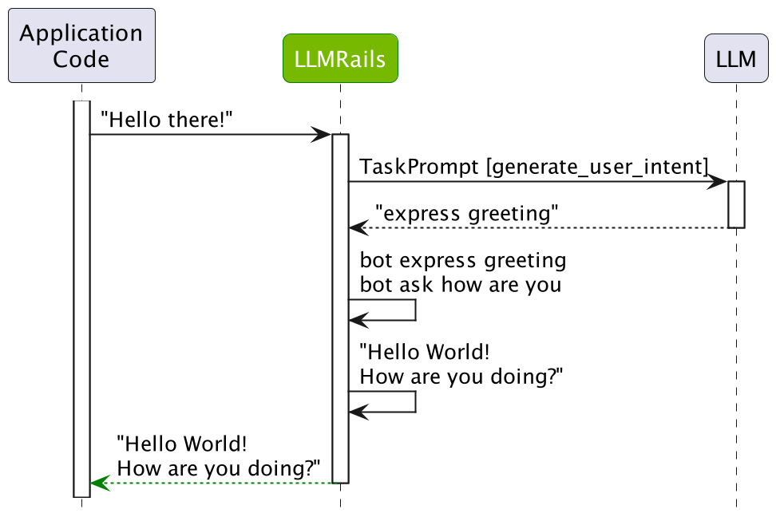
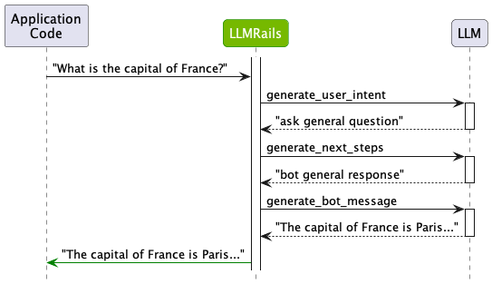

# Core Colang Concepts

This guide builds on the previous [Hello World guide](../1_hello_world/README.md) and introduces the core Colang concepts you should understand to get started with NeMo Guardrails.

## What is Colang?

Colang is a modeling language for conversational applications. Using Colang you can design how the conversation between a user and a **bot** should happen.

> **NOTE**: throughout this guide, the term *bot* is used to mean the entire LLM-based Conversational Application.

## Core Concepts

In Colang, the two core concepts are: **messages** and **flows**.

### Messages

In Colang, a conversation is modeled as an exchange of messages between a user and a bot. An exchanged **message** has an **utterance**, e.g. *"What can you do?"*, and a **canonical form**, e.g. `ask about capabilities`. A canonical form is a paraphrase of the utterance to a standard, usually shorter, form.

Using Colang, you can define the user messages that are important for your LLM-based application. For example, in the "Hello World" example, the `express greeting` user message is defined as:

```
define user express greeting
  "Hello"
  "Hi"
  "Wassup?"
```

The `express greeting` represents the canonical form and "Hello", "Hi" and "Wassup?" represent example utterances. The role of the example utterances is to teach the bot the meaning of a defined canonical form.

You can also define bot messages, i.e. how the bot should talk to the user. For example, in the "Hello World" example, the `express greeting` and `ask how are you` bot messages are defined as:

```
define bot express greeting
  "Hey there!"

define bot ask how are you
  "How are you doing?"
```

If more than one utterance are given for a canonical form, a random one will be used whenever the message is used.

**Are the *user message canonical forms* the same thing as classical intents?**

Yes, you can think of them as intents. However, when using them, the bot is not constrained to use only the pre-defined list.

### Flows

In Colang, **flows** represent patterns of interaction between the user and the bot. In their simplest form, they are sequences of user and bot messages. In the "Hello World" example, the `greeting` flow is defined as:

```colang
define flow greeting
  user express greeting
  bot express greeting
  bot ask how are you
```

Intuitively, this flow instructs the bot to respond with a greeting and ask how the user is feeling every time the user greets the bot.

## Guardrails

Messages and flows provide the core building blocks for defining **guardrails** (or "rails" for short). The `greeting` flow above is in fact a **rail** that guides the LLM how to respond to a greeting.

## How does it work?

Before moving further, let's take a closer look at what happens under the hood. Some of the questions that we are going to answer are:

- How are the user and bot message definitions used?
- How exactly is the LLM prompted and how many calls are made?
- Can I use bot messages without example utterances?

Let's run again the greeting example.

```python
from nemoguardrails import RailsConfig, LLMRails

config = RailsConfig.from_path("./config")
rails = LLMRails(config)

response = rails.generate(messages=[{
    "role": "user",
    "content": "Hello!"
}])
print(response["content"])
```

```
Hello World!
How are you doing?
```

### The `explain` feature

To get more visibility on what happens under the hood, we will make use of the *explain* feature that the `LLMRails` class provides.

```python
# We fetch the latest `ExplainInfo` object using the `explain` method.
info = rails.explain()
```

#### Colang History

Firstly, we can check the history of the conversation in Colang format. This shows us the exact messages and their canonical forms:

```python
print(info.colang_history)
```

```
user "Hello!"
  express greeting
bot express greeting
  "Hello World!"
bot ask how are you
  "How are you doing?"
```

#### LLM Calls

Secondly, we can check the actual LLM calls that have been made:

```python
info.print_llm_calls_summary()
```

```
Summary: 1 LLM call(s) took 0.48 seconds and used 524 tokens.

1. Task `generate_user_intent` took 0.48 seconds and used 524 tokens.
```

The `info` object also contains an `info.llm_calls` attribute with detailed information about each LLM call. We will look at this shortly.

### The process

Once an input message is received from the user, a multi-step process begins.

### Step 1: compute user message canonical form

After an utterance is received from the user (e.g., "Hello!" in the example above), the guardrails instance will compute the corresponding canonical form. By default, the LLM itself is used to perform this task.

> **NOTE**: NeMo Guardrails uses a task-oriented interaction model with the LLM. Every time the LLM is called, a specific task prompt template is used, e.g. `generate_user_intent`, `generate_next_step`, `generate_bot_message`. The default template prompts can be found [here](../../../nemoguardrails/llm/prompts/general.yml).

In the case of the "Hello!" message, a single LLM call was made using the `generate_user_intent` task prompt template. Let's see how the prompt looks like:

```python
print(info.llm_calls[0].prompt)
```

```
"""
Below is a conversation between a helpful AI assistant and a user. The bot is designed to generate human-like text based on the input that it receives. The bot is talkative and provides lots of specific details. If the bot does not know the answer to a question, it truthfully says it does not know.
"""

# This is how a conversation between a user and the bot can go:
user "Hello there!"
  express greeting
bot express greeting
  "Hello! How can I assist you today?"
user "What can you do for me?"
  ask about capabilities
bot respond about capabilities
  "As an AI assistant, I can help you with a wide range of tasks. This includes question answering on various topics, generating text for various purposes and providing suggestions based on your preferences."
user "Tell me a bit about the history of NVIDIA."
  ask general question
bot response for general question
  "NVIDIA is a technology company that specializes in designing and manufacturing graphics processing units (GPUs) and other computer hardware. The company was founded in 1993 by Jen-Hsun Huang, Chris Malachowsky, and Curtis Priem."
user "tell me more"
  request more information
bot provide more information
  "Initially, the company focused on developing 3D graphics processing technology for the PC gaming market. In 1999, NVIDIA released the GeForce 256, the world's first GPU, which was a major breakthrough for the gaming industry. The company continued to innovate in the GPU space, releasing new products and expanding into other markets such as professional graphics, mobile devices, and artificial intelligence."
user "thanks"
  express appreciation
bot express appreciation and offer additional help
  "You're welcome. If you have any more questions or if there's anything else I can help you with, please don't hesitate to ask."

# This is how the user talks:
user "Wassup?"
  express greeting

user "Hi"
  express greeting

user "Hello"
  express greeting

# This is the current conversation between the user and the bot:
# Choose intent from this list: express greeting
user "Hello there!"
  express greeting
bot express greeting
  "Hello! How can I assist you today?"
user "What can you do for me?"
  ask about capabilities
bot respond about capabilities
  "As an AI assistant, I can help you with a wide range of tasks. This includes question answering on various topics, generating text for various purposes and providing suggestions based on your preferences."
user "Hello!"
```

The prompt has four logical sections:

1. A set of general instructions. These can [be configured](../../user_guides/configuration-guide.md#general-instructions) using the `instructions` key in `config.yml`.

2. A sample conversation, which can also [be configured](../../user_guides/configuration-guide.md#sample-conversation) using the `sample_conversation` key in `config.yml`.

3. A set of examples for converting user utterances to canonical forms. The top five most relevant examples are chosen by performing a vector search against all the user message examples. For more details check out the [ABC Bot](../../../examples/bots/abc).

4. The current conversation preceded by the first two turns from the sample conversation.

For the `generate_user_intent` task, the LLM must predict the canonical form for the last user utterance.

```python
print(info.llm_calls[0].completion)
```

```
  express greeting
```

As we can see, the LLM correctly predicted the `express greeting` canonical form. It even went further to predict what the bot should do, i.e. `bot express greeting`, and the utterance that should be used. However, for the `generate_user_intent` task, only the first predicted line is used. If you want the LLM to predict everything in a single call, you can enable the [single LLM call option](#) in `config.yml` (by setting the `rails.dialog.single_call` key to `True`).

### Step 2: decide next step

After the canonical form for the user message has been determined, the guardrails instance needs to decide what should happen next. There are two cases:

1. If there is a flow that matches the canonical form, then it will be used. The flow can decide that the bot should respond with a certain message, or execute an action.
2. If there is no flow, the LLM is prompted for the next step, i.e. the `generate_next_step` task.

In our example, there was a match from the `greeting` flow and the next steps are:

```
bot express greeting
bot ask how are you
```

### Step 3: generate bot message

Once the canonical form for what the bot should say has been decided, the actual message needs to be generated. And here we have two cases as well:

1. If a predefined message is found, the exact utterance is used. If more than one example utterances are associated with the same canonical form, a random one will be used.
2. If a predefined message does not exist, the LLM will be prompted to generate the message, i.e. the `generate_bot_message` task.

In our "Hello World" example, the predefined messages "Hello world!" and "How are you doing?" have been used.

## The followup question

In the above example, we've seen a case where the LLM was prompted only once. The figure below provides a summary of the outlined sequence of steps:

<div align="center">

</div>

Now, let's look at the same process described above, on the followup question "What is the capital of France?".

```python
response = rails.generate(messages=[{
    "role": "user",
    "content": "What is the capital of France?"
}])
print(response["content"])
```

```
The capital of France is Paris.
```

Let's check the colang history:

```python
info = rails.explain()
print(info.colang_history)
```

```
user "What is the capital of France?"
  ask general question
bot response for general question
  "The capital of France is Paris."
```

And the LLM calls:

```python
info.print_llm_calls_summary()
```

```
Summary: 3 LLM call(s) took 1.79 seconds and used 1374 tokens.

1. Task `generate_user_intent` took 0.63 seconds and used 546 tokens.
2. Task `generate_next_steps` took 0.64 seconds and used 216 tokens.
3. Task `generate_bot_message` took 0.53 seconds and used 612 tokens.
```

Based on the above we can see that the `ask general question` canonical form is predicted for the user utterance "What is the capital of France?". Because there is no flow that matches it, the LLM is asked to predict the next step, which in this case is `bot response for general question`. And because there is no predefined response, the LLM is asked a third time to predict the final message.

<div align="center">

</div>

## Wrapping up

This guide has provided a detailed overview of two core Colang concepts: *messages* and *flows*. We've also looked at how the message and flow definitions are used under the hood and how the LLM is prompted. For more details, check out the reference documentation for the [Python API](../../user_guides/python-api.md) and the [Colang Language Syntax](../../user_guides/colang-language-syntax-guide.md).

## Next

In the [next guide](../3_demo_use_case) we pick a demo use case that we will use to implement different types of rails (input, output, dialog, etc.).
