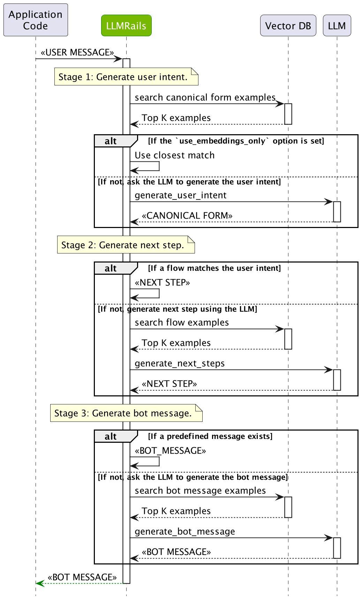

# Guardrails Process

This guide provides an overview of the five types of rails supported in NeMo Guardrails and of the process of invoking them.

## Overview

NeMo Guardrails has support for five main categories of rails: input, dialog, output, retrieval and execution. The diagram below provides an overview of the high-level flow through these categories of flows.

## Categories of Rails

1. **Input rails**: applied to the input from the user; an input rail can reject the input, stopping any additional processing, or alter the input (e.g., to mask potentially sensitive data, to rephrase).

2. **Dialog rails**: influence how the LLM is prompted; dialog rails operate on canonical form messages (more details [here](./colang-language-syntax-guide.md)) and determine if an action should be executed, if the LLM should be invoked to generate the next step or a response, if a predefined response should be used instead, etc.

3. **Retrieval rails**: applied to the retrieved chunks in the case of a RAG (Retrieval Augmented Generation) scenario; a retrieval rail can reject a chunk, preventing it from being used to prompt the LLM, or alter the relevant chunks (e.g., to mask potentially sensitive data).

4. **Execution rails**: applied to input/output of the custom actions (a.k.a. tools), that need to be called by the LLM.

5. **Output rails**: applied to the output generated by the LLM; an output rail can reject the output, preventing it from being returned to the user, or alter it (e.g., removing sensitive data).

## The Guardrails Process

The diagram below depicts the guardrails process in detail:

  

The guardrails process has multiple stages that a user message goes through:

1. **Input rails**: The user input is first processed by the input rails. The input rails decide if the input is allowed, whether it should be altered or rejected.
2. **Dialog rails**: If the input is allowed and the configuration contains dialog rails (i.e., at least one user message is defined), then the user message is processed by the dialog flows. This will ultimately result in a bot message.
3. **Output rails**: After a bot message is generate by the dialog rails, it is processed by the output rails. The Output rails decide if the output is allowed, whether it should be altered, or rejected.

## The Dialog Rails Flow

**TODO**: document

  

