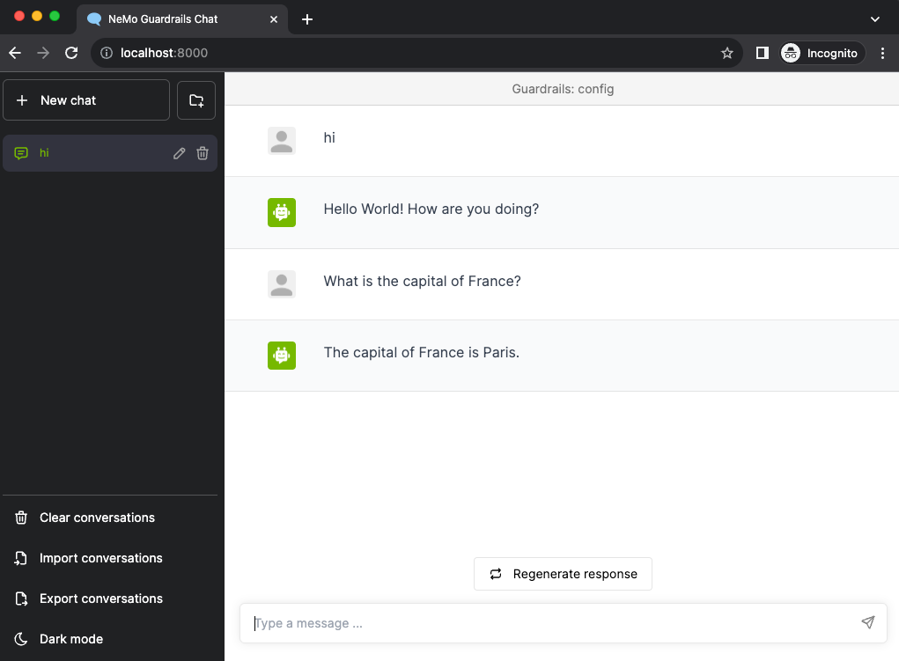

# Hello World

This guide will show you how to create a "Hello World" guardrails configuration, i.e. one where we only control the greeting behavior. Before we begin, make sure you have installed NeMo Guardrails correctly (for detailed instructions, check out the [Installation Guide](../../../../docs/getting_started/installation-guide.md)).

## Prerequisites

This "Hello World" guardrails configuration will use the OpenAI `text-davinci-003` model, so you need to make sure you have the `openai` package installed and the `OPENAI_API_KEY` environment variable set.

```bash
pip install openai==0.28.1
```

```bash
export OPENAI_API_KEY=$OPENAI_API_KEY    # Replace with your own key
```

## Step 1: create a new guardrails configuration

Every guardrails configuration must be stored in a folder. The standard folder structure is the following:

```
.
├── config
│   ├── actions.py
│   ├── config.py
│   ├── config.yml
│   ├── rails.co
│   ├── ...
```
For now, you don't need to worry about what goes into every file (you can check out the [Configuration Guide](../../../../docs/user_guide/configuration-guide.md) for more details later). Start by creating a folder for your configuration, e.g. `config`:

```bash
mkdir config
```

Next, create a `config.yml` file with the following content:

```yml title="config/config.yml"
models:
 - type: main
   engine: openai
   model: text-davinci-003
```

The `models` key in the `config.yml` file configures the LLM model. For a complete list of supported LLM models, check out [Supported LLM Models](../../../../docs/user_guide/configuration-guide.md#supported-llm-models) section in the configuration guide.

## Step 2: load the guardrails configuration

In your Python code base, to load a guardrails configuration from a path, you must create a `RailsConfig` instance using the `from_path` method:

```python
from nemoguardrails import RailsConfig

config = RailsConfig.from_path("./config")
```

## Step 3: use the guardrails configuration

You can already use this empty configuration by creating an `LLMRails` instance and using the `generate_async` method.

```python
from nemoguardrails import LLMRails

rails = LLMRails(config)

response = await rails.generate_async(messages=[{
    "role": "user",
    "content": "Hello!"
}])
print(response)
```

```
    {'role': 'assistant', 'content': 'Hi there! How can I help you?'}
```

The format for the input `messages` array as well as the response follow the same format as the [OpenAI API](https://platform.openai.com/docs/guides/text-generation/chat-completions-api).

## Step 4: add your first guardrail

To control the greeting response, you need to define the user and bot messages, as well as the flow that connects the two together. Don't worry about what exactly we mean by *messages* and *flows*, we'll cover that in the next guide. At this point, an intuitive understanding is enough.

To define the "greeting" user message, create a `config/rails.co` file and add the following:

```co title="config/rails.co"
define user express greeting
  "Hello"
  "Hi"
  "Wassup?"
```

To add a greeting flow which instructs the bot to respond back with "Hello World!" and ask how they are doing, add the following to the `rails.co` file:

```python
define flow greeting
  user express greeting
  bot express greeting
  bot ask how are you
```

To define the exact messages to be used for the response, add the following to the `rails.co` file:

```python
define bot express greeting
  "Hello World!"

define bot ask how are you
  "How are you doing?"
```

You can now reload the config and test it:

```python
config = RailsConfig.from_path("./config")
rails = LLMRails(config)

response = await rails.generate_async(messages=[{
    "role": "user",
    "content": "Hello!"
}])
print(response["content"])
```

```
    Hello World!
    How are you doing?
```

**Congratulations!** You've just created you first guardrails configuration.

### Other queries

What happens if you ask another question? (e.g., "What is the capital France?")

```python
response = await rails.generate_async(messages=[{
    "role": "user",
    "content": "What is the capital of France?"
}])
print(response["content"])
```

```
    The capital of France is Paris.
```

For any other input, which is not a greeting, the LLM will generate the response as usual. This is because the rail that we have defined is only concerned with how to respond to a greeting.

## CLI Chat

You can also test this configuration in an interactive mode using the NeMo Guardrails CLI Chat:

```bash
$ nemoguardrails chat
```

Without any additional parameters, the CLI chat will load the configuration from the `config` folder in the current directory.

Sample session:
```
$ nemoguardrails chat
Starting the chat (Press Ctrl+C to quit) ...

> Hello there!
Hello World!
How are you doing?

> What is the capital of France?
The capital of france is Paris.

> And how many people live there?
According to the latest estimates, the population of Paris is around 2.2 million people.
```

## Server and Chat UI

Last but not least, you can also test a guardrails configuration using the NeMo Guardrails server and the Chat UI.

To start the server:

```bash
$ nemoguardrails server --config=.

INFO:     Started server process [27509]
INFO:     Waiting for application startup.
INFO:     Application startup complete.
INFO:     Uvicorn running on http://0.0.0.0:8000 (Press CTRL+C to quit)
```

The Chat UI interface is now available at `http://localhost:8000`:



## Next

In the [next guide](../2_core_colang_concepts/README.md), we explain in more detail the two most important Colang concepts: *messages* and *flows*.
