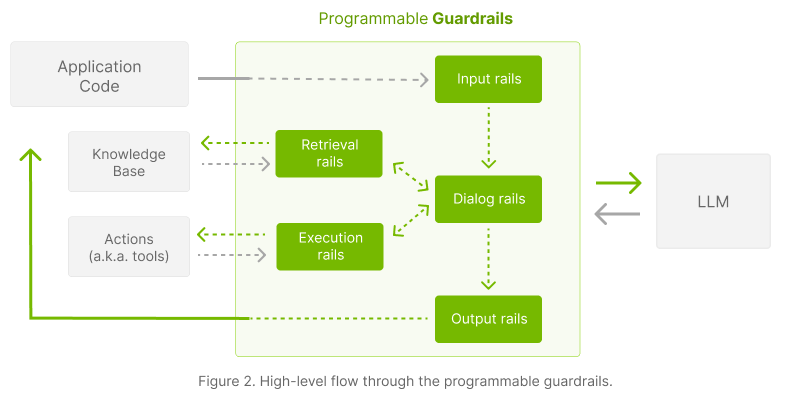

# Demo Use Case and Rails

Before moving further, let's pick a demo use case to build a guardrails configuration for: "Employment Info Bot". Each month the US Bureau of Labor Statistics publishes an [Employment Situation Report](https://www.bls.gov/news.release/empsit.toc.htm). Let's assume we want to build an LLM-based conversational application that answers questions using data from this report.

With this in mind, we will start expanding the guardrails configuration to cover various challenges we might face:

1. Input moderation.
2. Output moderation.
3. Preventing off-topic questions.
4. Fact-checking.
5. Hallucination detection.
6. ...

## Types of rails

1. **Input rails**: applied to the input from the user; an input rail can reject the input, stopping any additional processing, or alter the input (e.g., to mask potentially sensitive data, to rephrase).

2. **Dialog rails**: influence how the LLM is prompted; dialog rails operate on canonical form messages (more details [here](../../../../docs/user_guide/colang-language-syntax-guide.md)) and determine if an action should be executed, if the LLM should be invoked to generate the next step or a response, if a predefined response should be used instead, etc.

3. **Retrieval rails**: applied to the retrieved chunks in the case of a RAG (Retrieval Augmented Generation) scenario; a retrieval rail can reject a chunk, preventing it from being used to prompt the LLM, or alter the relevant chunks (e.g., to mask potentially sensitive data).

4. **Execution rails**: applied to input/output of the custom actions (a.k.a. tools), that need to be called by the LLM.

5. **Output rails**: applied to the output generated by the LLM; an output rail can reject the output, preventing it from being returned to the user, or alter it (e.g., removing sensitive data).

## Next
